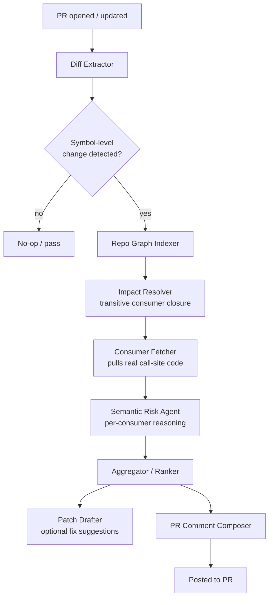

# Contract Guardian
### Cross-Repo Semantic Contract Drift Detection — Technical Blueprint & Build Plan

---

## 0. Executive Summary

**The problem:** In multi-service/multi-repo systems, a change to a shared type, API schema, or function contract can silently break downstream consumers. CI stays green because each repo's own tests pass in isolation — nobody checks whether the *assumptions* a consumer makes about a dependency still hold after the dependency changes. This surfaces in staging or production, well after the responsible engineer has moved on.

**The pitch:** Contract Guardian is a pre-merge agent that builds a cross-repo semantic dependency graph, computes the *true* blast radius of a change (not just direct callers), and uses LLM reasoning — not type matching — to judge whether each downstream consumer's assumptions still hold. It posts one consolidated, risk-ranked PR comment with evidence and draft fixes.

**Why it's hackathon-feasible:** The core techniques (AST parsing, call-graph construction, embedding-based retrieval, LLM-driven reasoning over structured context) are all buildable with open-source tooling in a 24–48 hour window if scoped correctly (see §6, MVP Scope). The demo does not require real production repos — a small synthetic multi-repo fixture with a deliberately breaking change tells the whole story in 3 minutes.

---

## 1. Problem Deep-Dive

### 1.1 What actually happens (concrete scenario)

1. `payments-service` exposes a function `calculateDiscount(order) -> float`, currently always returning a non-negative number.
2. An engineer changes it to allow negative returns (to represent a surcharge), because it's convenient for one new caller in the same repo.
3. `payments-service`'s own tests pass — the new caller is tested.
4. `invoice-service`, a separate repo, calls `calculateDiscount` and does `total = max(0, price - discount)`, silently *assuming* discount is non-negative. It has no test for negative discount because that was never a valid input when it was written.
5. Nothing fails in CI for `invoice-service` because its CI doesn't run against the new version of `payments-service` code — it runs against a pinned client/schema version that hasn't been bumped yet, or worse, against a mocked client.
6. The break surfaces in production days or weeks later as a support ticket about "negative invoice totals," and the responsible engineers have to reconstruct: what changed, who calls it, why did nobody know.

### 1.2 Why this is expensive and common

- **It's structural, not accidental.** Any org running microservices, a plugin architecture, or even a large monorepo with internal package boundaries has this class of risk baked into its architecture. The more successful the decomposition (more independent teams, more independent deploy cadences), the *worse* this problem gets — it's a direct tax on the microservices pattern.
- **It hides in the gap between "type-correct" and "semantically-correct."** Static type checkers verify shape (a function returns a `float`); they cannot verify *behavioral contracts* (that float is always ≥ 0, that a list is sorted, that a callback fires at most once, that an ID is idempotent). Most real contract breaks are behavioral, not shape-based.
- **Ownership diffusion.** The engineer changing the shared code often doesn't know all consumers exist, especially in orgs above ~15 engineers or with any amount of internal platform/library code. There is no single human whose job is "know every consumer of every internal API."
- **Cost asymmetry.** Catching this at PR-review time costs a few minutes of reasoning. Catching it in production costs an incident, a rollback, a postmortem, and — the part that compounds — it makes the *next* team afraid to refactor shared code, which is a direct tax on codebase health and velocity.

### 1.3 Why current tools don't catch this

| Tool category | What it does | Why it misses this |
|---|---|---|
| Static analyzers (ESLint, mypy, SonarQube) | Enforce syntax/type rules within a compilation unit | Operate on shape, not behavior; almost never cross repo boundaries; no concept of "semantic contract" |
| AI coding assistants (Copilot, Cursor) | Generate/complete code with local file + limited repo context | Optimized for the file/function you're currently editing, not for traversing an *external* repo's consumer code you've never opened |
| PR bots (CodeRabbit, Copilot PR summaries) | Summarize a diff, catch style/lint issues, sometimes flag "risky" patterns heuristically | Treat the PR as a closed artifact; don't fetch and reason over code in *other* repositories that consume the changed symbol |
| API contract testing (Pact, schema registries) | Validate a **declared** contract (OpenAPI/schema) between producer/consumer | Only works if a formal contract was declared *and kept in sync* — doesn't catch internal library calls, undeclared behavioral assumptions, or contracts nobody thought to formalize |
| Dependency graph tools (Nx, Bazel) | Know which packages/targets depend on which, at the build-graph level | Know *that* a dependency exists, not *what assumption* the consumer makes about it — no semantic reasoning layer |

**The gap, stated precisely:** nobody today combines (a) precise cross-repo symbol-level reachability with (b) LLM-grade semantic reasoning about whether a specific behavioral assumption still holds, delivered as a pre-merge gate. Each half exists somewhere; the combination doesn't.

---

## 2. System Architecture

### 2.1 High-level flow



### 2.2 Component responsibilities

**1. Repo Graph Indexer** (runs continuously / incrementally, not per-PR)
- Parses every tracked repo with a language-appropriate AST tool (`tree-sitter` covers most languages with one library).
- Extracts a **symbol table**: functions, exported types, API route handlers, public class methods — with file, line range, signature, and docstring/comments.
- Extracts a **call/reference graph**: for each symbol, which symbols in *other* repos import or call it (via static import resolution + string-matched API route calls for HTTP boundaries).
- Persists as a lightweight graph store (SQLite with an edges table is sufficient for a hackathon; Neo4j if you want the demo visual).

**2. Diff Extractor** (per-PR, triggered by webhook)
- Parses the PR diff to identify which *symbols* changed (not just which lines) — a changed function body, changed signature, changed exported type shape, changed return-path logic.
- Filters out purely cosmetic diffs (formatting, comments) to avoid wasted downstream work.

**3. Impact Resolver**
- Queries the graph store for the **transitive closure** of consumers of each changed symbol, up to a configurable depth (2–3 hops is usually enough to catch the non-obvious cases; direct callers are what existing tools already sort of catch).
- Ranks consumers by proximity (direct call > transitive call) and by repo criticality (a config file can mark repos as `tier: critical`).

**4. Consumer Fetcher**
- For each consumer identified, pulls the *actual call-site code* (a window of surrounding lines, not just the one line of the call) plus that consumer's own tests referencing the symbol, if any.

**5. Semantic Risk Agent** (the core LLM reasoning step — this is the differentiator)
- Given: (a) the diff of the changed symbol, (b) the old and new implementation, (c) one consumer's call-site code.
- Prompted to answer a structured question: *"Does this call site make any assumption about the behavior, return shape, ordering, nullability, or side effects of the changed symbol that the new implementation may violate? Answer with a risk level (none/low/medium/high), a one-sentence explanation, and the specific assumption if any."*
- Run this **once per consumer**, in parallel, as independent subagent calls — this is where "subagent orchestration" earns its keep: each call is a small, well-scoped reasoning task rather than one giant prompt trying to hold every consumer in context at once (which degrades reasoning quality and blows context limits fast).

**6. Aggregator / Ranker**
- Collects all subagent verdicts, sorts by risk level and consumer criticality, discards `none`/`low` unless explicitly requested.

**7. Patch Drafter** *(stretch goal, not MVP)*
- For `high` risk findings, asks an LLM to draft a minimal defensive patch at the consumer call site (e.g., add a `max(0, ...)` guard) — presented as a **suggested diff**, never auto-applied.

**8. PR Comment Composer**
- Renders one consolidated Markdown comment: risk-ranked list, each with the consumer file/line, the specific assumption at risk, and (if generated) the suggested patch as a collapsible diff block.

### 2.3 Data model (minimum viable schema)

```
symbols(id, repo, file, name, kind, signature, start_line, end_line, hash)
edges(caller_symbol_id, callee_symbol_id, call_site_file, call_site_line, edge_type)
   -- edge_type: "direct_import" | "http_call" | "event_subscribe"
findings(pr_id, changed_symbol_id, consumer_symbol_id, risk_level, explanation, suggested_patch)
```

This schema is intentionally small. Resist the urge to model a "perfect" universal call graph for the hackathon — direct import calls plus a naive string-match for HTTP route calls (`GET /api/discount` ↔ handler registration) covers the demo case entirely.

---

## 3. Solution Blueprint — Why Subagent Orchestration Specifically

A single-prompt approach ("here's a diff and here are 10 files, tell me what breaks") fails in practice for three reasons that are worth stating explicitly in your hackathon pitch, because judges will ask "why not just do one big prompt?":

1. **Context dilution.** Stuffing 10 consumers' worth of code into one prompt means the model's attention is divided across all of them; per-consumer accuracy drops as the prompt grows. Splitting into N independent subagent calls (one per consumer) keeps each reasoning task small and high-precision.
2. **Parallelism = latency.** Independent subagent calls can run concurrently, so wall-clock time for a PR with 12 consumers is roughly the time for *one* call, not twelve sequential ones — critical for a pre-merge check that developers won't tolerate waiting minutes for.
3. **Isolated failure.** If one consumer's code is malformed or the reasoning call errors out, it doesn't take down the analysis of the other eleven consumers — you degrade gracefully instead of failing the whole check.

This is the concrete, defensible answer to "why do you need agents/orchestration and not just a script + one GPT call" — a question judges in an agentic-workflow hackathon will almost certainly ask.

---

## 4. Tech Stack (hackathon-optimized for speed of build)

| Layer | Choice | Why |
|---|---|---|
| AST parsing | `tree-sitter` (Python bindings) | One library, many languages, mature, fast to get symbol extraction working |
| Graph store | SQLite | Zero setup, good enough for a demo-scale graph, trivially inspectable |
| Orchestration | Python + `asyncio` for parallel subagent calls | No need for a heavyweight agent framework for a hackathon; explicit control is easier to debug live |
| LLM calls | Claude via Anthropic API (Messages API), one call per subagent role | Structured output via forced JSON-only system prompts for the risk-scoring subagent |
| PR integration | GitHub REST API (webhook on `pull_request` events + comment POST) | GitHub is the default judge-familiar surface |
| Demo repos | 2–3 tiny synthetic repos you control (e.g., `payments-service`, `invoice-service`, `reporting-service`) | Full control over the "aha" moment — a real large repo pair is not necessary and adds risk |

**Do not** try to support multiple languages, a real production-scale monorepo, or a polished web dashboard for the MVP. The differentiator is the *reasoning quality*, not breadth of language support or UI polish.

---

## 5. Build Plan / Timeline (for a 24–36 hour hackathon)

### Phase 0 — Setup (Hour 0–2)
- Create 3 tiny synthetic repos (or 3 folders simulating repos) with a deliberate, non-obvious contract break planned in advance (know your demo story before you write any code).
- Set up GitHub webhook → a small FastAPI/Flask endpoint (can run via `ngrok` for the demo) that receives `pull_request` events.

### Phase 1 — Indexer (Hour 2–8)
- `tree-sitter`-based symbol extractor for the target language (pick one — Python or JS — and go deep, not broad).
- Simple import-resolution pass to build direct-call edges across the 3 repos.
- Store in SQLite; write a 10-line script to print the graph for a symbol as a sanity check.

### Phase 2 — Diff → Impact Resolver (Hour 8–14)
- Parse the incoming PR diff (via GitHub API), map changed lines to changed symbols using the indexer's symbol table.
- Query the graph for the transitive consumer closure (BFS, depth 2–3).

### Phase 3 — Semantic Risk Agent (Hour 14–22) — **the core, spend the most time here**
- Build the per-consumer prompt template (old code, new code, consumer call-site code, structured JSON output spec).
- Fire subagent calls concurrently (`asyncio.gather`), with a timeout and graceful degradation per call.
- Iterate on the prompt with your planted "discount can go negative" scenario until the model reliably flags it as `high` risk with the correct explanation — this prompt-quality loop is where your actual differentiation lives, budget real time for it.

### Phase 4 — Aggregation + PR Comment (Hour 22–28)
- Rank and format findings into one Markdown comment.
- Post via GitHub API to the PR.
- (Stretch, if time allows) Add the Patch Drafter subagent for the top `high` finding only.

### Phase 5 — Polish + Demo Rehearsal (Hour 28–34)
- Rehearse the live demo end-to-end at least 3 times before presenting.
- Prepare a fallback: a pre-recorded run or cached output in case live API calls are slow/rate-limited during the actual presentation.

---

## 6. MVP Scope vs. Stretch Goals

**MVP (must work live in the demo):**
- 3 synthetic repos, one language, one deliberate contract break.
- Full pipeline: index → diff → impact resolution → per-consumer semantic reasoning → single ranked PR comment.
- Correctly flags the planted break as `high` risk with a coherent explanation.

**Stretch goals (impressive if time allows, cut without shame if not):**
- Patch Drafter producing a suggested fix diff.
- A second language supported by the indexer (proves generality without needing full multi-language depth).
- A simple graph visualization (even a static Mermaid render of the consumer chain for the flagged symbol) shown in the demo — visuals help judges retain the story.
- Confidence calibration: track how often "high" findings are true positives across a few more planted scenarios, to show a real (if small) precision number.

**Explicitly out of scope — say so proactively in your pitch, it builds credibility:**
- Multi-language support beyond 1–2 languages.
- Auto-merging or auto-blocking PRs (this should always be advisory, human-in-the-loop — say this explicitly, judges will appreciate the safety framing).
- Handling dynamically-typed languages' full behavioral inference (you're using LLM reasoning specifically because you're *not* trying to solve this with static analysis alone).

---

## 7. Validation Metrics (for the pitch/judging criteria)

Frame these as what a real engineering team would track post-adoption:

| Metric | What it proves | How to demo/simulate it |
|---|---|---|
| **Shift-left ratio** — % of contract-breaking changes caught pre-merge vs. found in production | Core value prop | Show the planted break caught pre-merge; contrast with the "today" scenario (CI green, break ships) |
| **MTTR reduction** for this incident class | Downstream business value | Cite that root-cause reconstruction (the "who calls this, why did nobody know" step) is eliminated entirely when the graph already exists |
| **False-positive rate** on the risk agent | Adoption viability — too noisy and teams disable it | Run against 1–2 *non-breaking* changes in your demo repos and show the agent correctly returns `low`/`none` risk, not just detects the one break you planted |
| **Time-to-first-signal** | Developer experience | Report actual wall-clock time from PR open to comment posted in your demo |
| **Engineer-hours saved on manual impact analysis** | Cost justification for leadership buy-in | Estimate based on typical "grep + Slack archaeology" time your team has likely experienced — even an anecdotal 30–60 min/incident number is a legitimate talking point |

---

## 8. Risks & Mitigations

| Risk | Mitigation |
|---|---|
| LLM reasoning is inconsistent/flaky under time pressure during live demo | Cache the exact demo run's API responses ahead of time as a fallback; rehearse with live calls but have a recorded backup |
| Cross-repo import resolution is harder than expected for the chosen language | Pick the language with the simplest import syntax to resolve (Python's explicit imports are easier than JS's mixed CJS/ESM); don't attempt full type-inference |
| Judges ask "how does this scale to a 10,000-symbol real monorepo?" | Have a one-sentence answer ready: incremental indexing (only re-index changed files on merge, not full repo rescans) plus the fact that the *expensive* part (LLM reasoning) only runs on the small transitive-closure subset per PR, not the whole graph |
| Scope creep during build | Refer back to §6 — cut stretch goals first, never cut the core reasoning-quality iteration time in Phase 3 |

---

## 9. Suggested Demo Script (3 minutes)

1. **(20s)** State the problem in one sentence with the `calculateDiscount` scenario — make it visceral, not abstract.
2. **(30s)** Show the three synthetic repos and the dependency relationship on screen (even a simple diagram).
3. **(30s)** Open a real PR that makes the negative-discount change.
4. **(60s)** Show Contract Guardian's pipeline running live (or the cached output), landing on the PR as one consolidated comment flagging `invoice-service` as `high` risk with the specific assumption named.
5. **(20s)** Contrast: "This is exactly the class of bug that shipped [cite a well-known real-world incident type, e.g., a schema-change outage] — caught here in seconds instead of a production incident."
6. **(20s)** Close with the validation metrics table and the one clear callout: *this is advisory, human-approved, never auto-merging* — safety framing lands well with judges.

---

*This document is intended as your internal working spec — trim the architecture/build-plan sections into your actual submission format (slide deck, README, or written proposal) as needed for the hackathon's requirements.*
